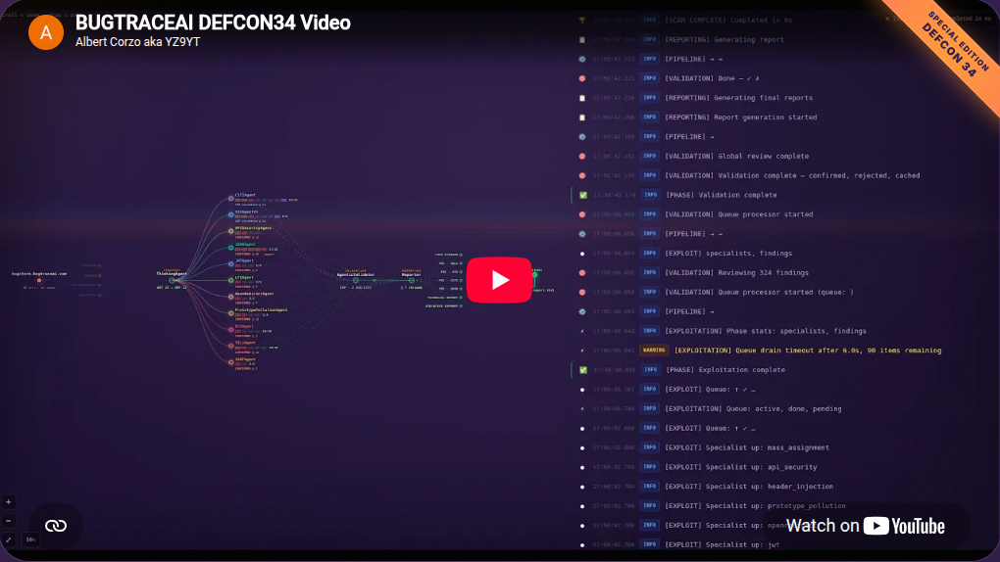
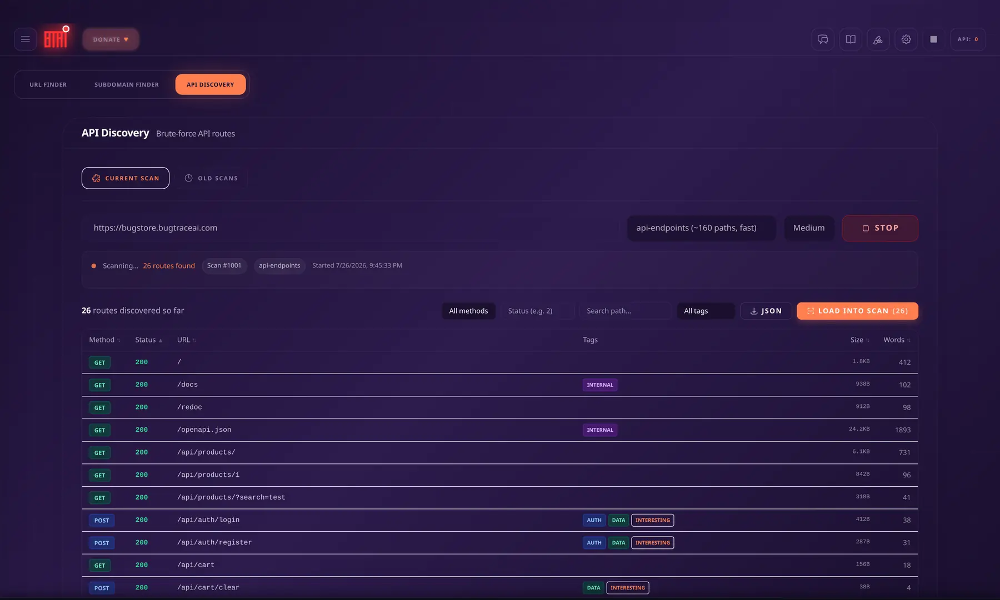
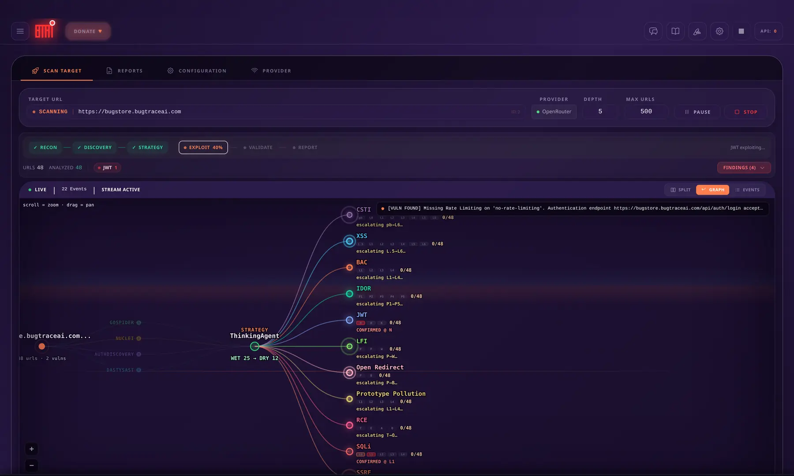
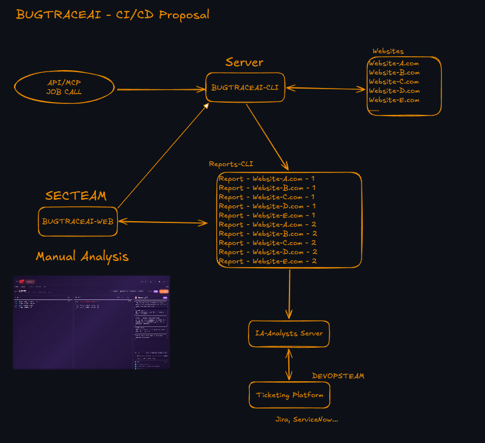

<p align="center">
  
</p>

<h1 align="center">BugTraceAI</h1>

<p align="center">
  Autonomous, self-hosted security testing for authorized bug bounty and pentesting
</p>

<p align="center">
  <a href="https://bugtraceai.com"></a>
  <a href="https://github.com/BugTraceAI/BugTraceAI/wiki"></a>
  <a href="https://deepwiki.com/BugTraceAI/BugTraceAI"></a>
  <a href="https://demo.bugtraceai.com/bugtraceai"></a>
  <a href="https://discord.gg/5HjujkScC"></a>
  <a href="https://github.com/BugTraceAI/BugTraceAI/releases/download/demo-report/BugTraceAI-Demo-Report.zip"></a>
  
  
  
  
</p>

<p align="center">
  
  
  
  
  
  
</p>

<p align="center">
  <a href="https://www.youtube.com/watch?v=FCoQNgO8hmM"></a>
  <a href="https://demo.bugtraceai.com/bugtraceai"></a>
  <a href="https://github.com/BugTraceAI/BugTraceAI/stargazers"></a>
  <a href="https://discord.gg/5HjujkScC"></a>
</p>

<p align="center">
  <a href="https://www.youtube.com/watch?v=FCoQNgO8hmM">
    
  </a>
</p>

---

## Proven in the Security Community

### CVEs Disclosed

| Product | CVE | CVSS |
| ------- | --- | ---- |
| Wallos | [CVE-2026-27479](https://www.cve.org/CVERecord?id=CVE-2026-27479) | 7.7 High |
| ZoneMinder | [CVE-2026-27470](https://www.cve.org/CVERecord?id=CVE-2026-27470) | 8.8 High |
| Piwigo | [CVE-2026-27834](https://www.cve.org/CVERecord?id=CVE-2026-27834) | 7.2 High |

### Presented On Stage

- [RootedCON 2026](https://reg.rootedcon.com/cfp/speaker/795), Madrid, Spain
- [HKOSCon 2026](https://hkoscon.org/2026/topic/bugtraceai-open-source-agentic-ai-for-autonomous-multi-agent-bug-bounty-pentesting/), Hong Kong
- [DEF CON 34](https://defcon.org/html/defcon-34/dc-34-speakers.html#content_66648), Las Vegas, USA

### See It Working

<p align="center">
  
  
</p>

BugTraceAI combines AI-guided investigation with deterministic security tools. The AI prioritizes and reasons about hypotheses; tools and evidence validate what is real.

## Disclaimer

This platform is provided for **educational and authorized security testing purposes only**.

- Only test applications for which you have **explicit, written authorization**
- AI output may contain inaccuracies, false positives, or false negatives
- It is **not** a substitute for professional security auditing
- The creators assume no liability for misuse or damage

**Always verify findings manually.**

---

## What is BugTraceAI?

**BugTraceAI** is an **opensource, self-hosted framework for bug bounty hunting and penetration testing**. It combines autonomous AI agents with real security tools to discover, analyze, exploit, and validate vulnerabilities independently.

This is **NOT** a wrapper around existing tools. It is an autonomous multi-agent system where AI agents make intelligent decisions about what to test, how to mutate payloads, and when findings are real.

### Core Principles

| Principle         | Description                                                             |
| ----------------- | ----------------------------------------------------------------------- |
| **Privacy-First** | Everything runs locally. No telemetry, no tracking, no cloud dependency |
| **Opensource**    | AGPL-3.0 licensed. All code, prompts, and algorithms are public         |
| **Self-Hosted**   | Your data stays on your infrastructure                                  |
| **Modular**       | Use components independently or together                                |
| **Docker-Native** | One-command deployment via Launcher                                     |

---

## The Ecosystem

BugTraceAI is composed of **4 independent but interconnected components**, plus a dedicated practice target:

<table>
  <tr>
    <th>Component</th>
    <th>Description</th>
    <th>Tech Stack</th>
    <th>Repository</th>
  </tr>
  <tr>
    <td><strong>BugTraceAI-CLI</strong></td>
    <td>Autonomous AI security scanner. Multi-agent pipeline with Go fuzzers, Playwright browser validation, and AI-driven analysis</td>
    <td>Python + FastAPI + Go + Playwright</td>
    <td><a href="https://github.com/BugTraceAI/BugTraceAI-CLI">BugTraceAI-CLI</a></td>
  </tr>
  <tr>
    <td><strong>BugTraceAI-WEB</strong></td>
    <td>Web dashboard with 20+ AI security tools, real-time scan monitoring, and CLI control center</td>
    <td>React + Express + PostgreSQL</td>
    <td><a href="https://github.com/BugTraceAI/BugTraceAI-WEB">BugTraceAI-WEB</a></td>
  </tr>
  <tr>
    <td><strong>BugTraceAI-Launcher</strong></td>
    <td>One-command Docker deployment wizard with interactive setup, service management, and an optional <strong>AI Setup & Repair Assistant</strong> (DeepSeek V3 with automatic Claude Haiku 4.5 fallback) that can install or repair a deployment</td>
    <td>Bash + Python + Docker Compose</td>
    <td><a href="https://github.com/BugTraceAI/BugTraceAI-Launcher">BugTraceAI-Launcher</a></td>
  </tr>
  <tr>
    <td><strong>MCP Ecosystem</strong></td>
    <td>Extensible agent framework using the Model Context Protocol. Includes integrated Kali Linux and ReconFTW agents</td>
    <td>MCP + Docker + Python</td>
    <td><a href="https://github.com/BugTraceAI/reconftw-mcp">reconftw-mcp</a></td>
  </tr>
  <tr>
    <td><strong>BugStore</strong></td>
    <td>Deliberately vulnerable practice target used in demos and walkthroughs. Full-featured shop riddled with 32 planted OWASP vulnerabilities</td>
    <td>Python + FastAPI + SQLite</td>
    <td><a href="https://github.com/BugTraceAI/BugStore">BugTraceAI/BugStore</a></td>
  </tr>
</table>

Each component works **independently**. Use the WEB alone for AI analysis, the CLI alone for autonomous scanning, or deploy everything together with the Launcher.

---

## Architecture

```
                    +----------------------------+
                    |      BugTraceAI-WEB        |
                    |   React + Express + PgSQL  |
                    |   Port 6869 / Port 3001    |
                    +-------------+--------------+
                                  |
                          REST API + WebSocket
                                  |
                    +-------------+-----------------+
                    |      BugTraceAI-CLI           |
                    |   FastAPI + SQLite + LanceDB  |
                    |        Port 8000              |
                    +---+--------+-------------+----+
                        |        |             |
                   +----+--+ +---+------+ +----+------+
                   |Go     | |Playwright| |AI Agents  |
                   |Fuzzers| |Browser   | |OpenRouter |
                   +-------+ +----------+ +-----------+
```

**SQLite** is the source of truth for all scan data. **PostgreSQL** is local to each WEB instance for chats, settings, and analysis. They work **autonomously OR together** -- multiple WEB instances can connect to one CLI over the network.

For detailed architecture documentation, see the [Wiki](https://github.com/BugTraceAI/BugTraceAI/wiki/Architecture).

---

## Scanning Pipeline

The CLI runs a **6-phase autonomous pipeline**:

| Phase | Name              | Description                                                                                                                                                                                          |
| ----- | ----------------- | ---------------------------------------------------------------------------------------------------------------------------------------------------------------------------------------------------- |
| 1     | **Discovery**     | Crawl and spider the target to map the attack surface                                                                                                                                                |
| 2     | **Analysis**      | Multi-persona AI analysis with consensus voting                                                                                                                                                      |
| 3     | **Consolidation** | Deduplicate findings and distribute to specialist queues                                                                                                                                             |
| 4     | **Exploitation**  | 15 specialist agents (XSS, SQLi, SSRF, IDOR, LFI, RCE, XXE, JWT, Open Redirect, Prototype Pollution, CSTI, Mass Assignment, Header Injection, API Security, File Upload) with Go fuzzers and AI-mutated payloads |
| 5     | **Validation**    | Chrome DevTools Protocol + Vision AI screenshot analysis confirms findings                                                                                                                           |
| 6     | **Reporting**     | PoC enrichment with WET/DRY traceability, AI-generated technical and executive reports                                                                                                               |

The pipeline includes a **circuit breaker** that auto-pauses scanning when the target becomes unresponsive, and supports **authenticated scanning** via YAML configuration with automatic TOTP/2FA token generation for login-protected targets.

For the full pipeline documentation, see the [Wiki](https://github.com/BugTraceAI/BugTraceAI/wiki/Scanning-Pipeline).

---

## What's New

### BugTraceAI-WEB v1.5.40-beta
- **AIrepeater** — Burp/Caido-style multi-tab HTTP workbench with manual and AI-agent-driven exploitation modes, per-vulnerability playbooks, response search, and report handoff; the exploit model is provider-guarded and a dry-run button verifies the auto-auth macro before you rely on it
- **Live Swarm Graph** — real-time visualization of reconnaissance, strategy, specialist, validation, and reporting stages, with per-agent L1→L6 escalation ladders that climb live as each agent works
- **Model Lab module** — standalone sidebar module at `/modellab` for benchmarking OpenRouter models with its own API key: calibrated `quick-v3` / `advanced-v2` suites, a "Best per slot" leaderboard (MUTATION / SKEPTICAL / ANALYSIS / REPORTING), an opt-in MUTATION diversity probe, live WebSocket progress, cost visibility, and local history
- **Anthropic chat provider** — Claude (Messages API, `x-api-key`) selectable alongside OpenRouter and Z.ai for chat, analysis, and the Repeater, with tool-calling normalized to the shared shape
- **Curated model pack + Thinking control** — a hand-picked, verified OpenRouter model list plus Thinking / High / xHigh entries that enable OpenRouter's reasoning parameter
- **Report Enrich + AuthDiscovery visibility** — a self-heal "Enrich" button re-runs PoC/CVSS enrichment when a report comes out under-enriched, and AuthDiscovery start, per-URL progress, and JWT/cookie totals surface in the Events feed and Swarm Graph

### BugTraceAI-CLI v3.7.12-beta
- **Anthropic direct-API provider** — Anthropic is a first-class LLM provider via API key (`x-api-key`, Messages API); a new `api_format` preset field decouples the wire format so generation, threaded generation, vision, and connectivity all route to the Anthropic Messages API when active
- **Integrated Model Lab (model-eval)** — `/api/model-eval` endpoints with a per-request OpenRouter key and live WebSocket progress; quality-dominant recalibration, new `quick-v3` / `advanced-v2` suites, a per-slot leaderboard (MUTATION / SKEPTICAL / ANALYSIS / REPORTING), and an opt-in MUTATION diversity probe
- **Reporting/enrichment failover + provenance** — PoC/CVSS enrichment falls back to a secondary provider (`REPORTING_FAILOVER_ENABLED` / `REPORTING_FAILOVER_PROVIDER`, default `anthropic`) for that call only, never changing the scan's active provider; `poc_enrichment_provenance` and `reporting_failover_count` make reporting saturation visible in the deliverable
- **Dedup & detection fixes** — RCE-family findings canonicalize to a single type (no double-count), strong-evidence IDORs route to MANUAL_REVIEW instead of being buried, and boolean-blind SQLi diffing is capped/off-thread to prevent event-loop stalls
- **Deliverable parity** — pending (POTENTIAL) findings appear across Markdown, engagement JSON, and `validated_findings.json`, and the "Findings by Severity" totals now match across all deliverables

### BugTraceAI-Launcher v2.8.7
- **Anthropic provider** — pick Claude direct API (`sk-ant-...`, Messages API) as the LLM provider, both in the standard provider selector (which configures the deployed CLI) and in the AI Setup & Repair Assistant
- **AI Setup & Repair Assistant** — Choose standard guided setup, or let the AI agent install from scratch **or** diagnose/repair an existing deployment; runs on DeepSeek V3 (OpenRouter) or Claude Haiku 4.5 (Anthropic direct), selected at startup, with an automatic sticky fallback on the OpenRouter path
- **Safer & English-only** — destructive commands (e.g. `docker compose down -v`) are classified and gated, the UI is English-only, and the installer core was hardened with added tests
- **Hardened & robust** — Native Docker build output (no fragile spinner), multi-distro dependency install (apt/dnf/yum/pacman/zypper), `600`-permission config files, hidden/masked API-key entry, kernel-enforced command timeouts
- **macOS Apple Silicon** — Full Colima/Docker Desktop support with ARM patches for reconFTW and Kali MCPs

---

## Demo Report

Want to see what BugTraceAI produces? Try the **live demo** or download a real scan report generated against [BugStore](https://bugstore.bugtraceai.com/) -- our deliberately vulnerable practice app.

<p align="center">
  <a href="https://demo.bugtraceai.com/bugtraceai">
    
  </a>
  &nbsp;
  <a href="https://github.com/BugTraceAI/BugTraceAI/releases/download/demo-report/BugTraceAI-Demo-Report.zip">
    
  </a>
</p>

**Scan highlights**: 145 findings (43 validated) -- SQL Injection, XSS, LFI, CSTI, IDOR, JWT, RCE, Broken Access Control, Open Redirect, Prototype Pollution, GraphQL, SSRF, and more.

> **Benchmark note:** This demo report was produced with an earlier scanner build. Results are useful for exploring the workflow, but should not be treated as a current performance claim for the latest CLI release until re-run under a versioned benchmark protocol.

The zip includes the full markdown report, validated findings JSON, specialist agent results with WET/DRY traceability, reconnaissance data, and PoC enrichment output.

---

## CI/CD Integration Proposal

BugTraceAI can operate as a security testing service in a CI/CD workflow: receive authorized jobs through its API or MCP layer, scan approved targets, publish evidence-rich reports, and pass validated findings into analysis and ticketing workflows.

<p align="center">
  
</p>

The WEB workspace supports manual analysis alongside autonomous scans, while the CLI exposes the control and reporting surface needed for automation.

---

## Quick Start

### Requirements

- Docker 24.0+
- Git
- 4 GB RAM (8 GB recommended)
- 10 GB disk space
- OpenRouter API key

### One-Command Install

**One-liner** (recommended):

```bash
curl -fsSL https://raw.githubusercontent.com/BugTraceAI/BugTraceAI-Launcher/main/install.sh | bash
```

Or clone and run manually:

```bash
git clone https://github.com/BugTraceAI/BugTraceAI-Launcher.git ~/bugtraceai-launcher
~/bugtraceai-launcher/launcher.sh
```

The interactive wizard handles deployment mode selection, API key configuration, and port assignment. If anything goes wrong, the optional **AI Setup & Repair Assistant** (powered by DeepSeek V3 with automatic Claude Haiku 4.5 fallback) can install from scratch or diagnose and repair an existing deployment.

### Deployment Modes

| Mode               | What You Get             | Use Case                         |
| ------------------ | ------------------------ | -------------------------------- |
| **Full Platform**  | WEB + CLI auto-connected | Complete scanning + dashboard    |
| **Standalone CLI** | Headless scanner + API   | CI/CD pipelines, automation      |
| **Standalone WEB** | Dashboard + AI tools     | Manual analysis without scanning |

### Alternative: Individual Components

```bash
# CLI only
git clone https://github.com/BugTraceAI/BugTraceAI-CLI.git
cd BugTraceAI-CLI
pip install -r requirements.txt
python -m bugtrace --help

# WEB only
git clone https://github.com/BugTraceAI/BugTraceAI-WEB.git
cd BugTraceAI-WEB
docker compose up
```

---

## Documentation

Full documentation is available in the **[Project Wiki](https://github.com/BugTraceAI/BugTraceAI/wiki)**:

- [Overview](https://github.com/BugTraceAI/BugTraceAI/wiki/Overview) -- What BugTraceAI is and who it's for
- [Architecture](https://github.com/BugTraceAI/BugTraceAI/wiki/Architecture) -- System design and communication protocols
- [BugTraceAI-CLI](https://github.com/BugTraceAI/BugTraceAI/wiki/BugTraceAI-CLI) -- Autonomous scanner documentation
- [BugTraceAI-WEB](https://github.com/BugTraceAI/BugTraceAI/wiki/BugTraceAI-WEB) -- Web dashboard documentation
- [BugTraceAI-Launcher](https://github.com/BugTraceAI/BugTraceAI/wiki/BugTraceAI-Launcher) -- Deployment guide
- [API Reference](https://github.com/BugTraceAI/BugTraceAI/wiki/API-Reference) -- REST API and WebSocket endpoints
- [Getting Started](https://github.com/BugTraceAI/BugTraceAI/wiki/Getting-Started) -- Installation and first scan

---

## Community & Support

| Resource | Link                                                             |
| -------- | ---------------------------------------------------------------- |
| Website  | [bugtraceai.com](https://bugtraceai.com)                         |
| Wiki     | [GitHub Wiki](https://github.com/BugTraceAI/BugTraceAI/wiki)     |
| DeepWiki | [AI-powered docs](https://deepwiki.com/BugTraceAI/BugTraceAI)    |
| Issues   | [GitHub Issues](https://github.com/BugTraceAI/BugTraceAI/issues) |
| Discord  | [Join the BugTraceAI community](https://discord.gg/5HjujkScC)    |
| Twitter  | [@yz9yt](https://x.com/yz9yt)                                    |

### Contributing

We welcome contributions: bug reports, feature requests, PRs, documentation improvements, and community tools. Open an issue on the respective repository to get started.

---

## License

**AGPL-3.0 License** — Free to use, modify, and distribute. If you modify and distribute or offer as a service, you must share your changes under the same license.

See LICENSE file in each repository.

---

<p align="center">
  <strong>BugTraceAI</strong> -- Build your own self-hosted pentesting platform.<br/>
  If BugTraceAI helps your authorized security research, consider <a href="https://github.com/BugTraceAI/BugTraceAI/stargazers">giving the project a star</a> or <a href="https://discord.gg/5HjujkScC">joining the community on Discord</a>.<br/>
  <a href="https://github.com/yz9yt">Albert C (@yz9yt)</a>
</p>
