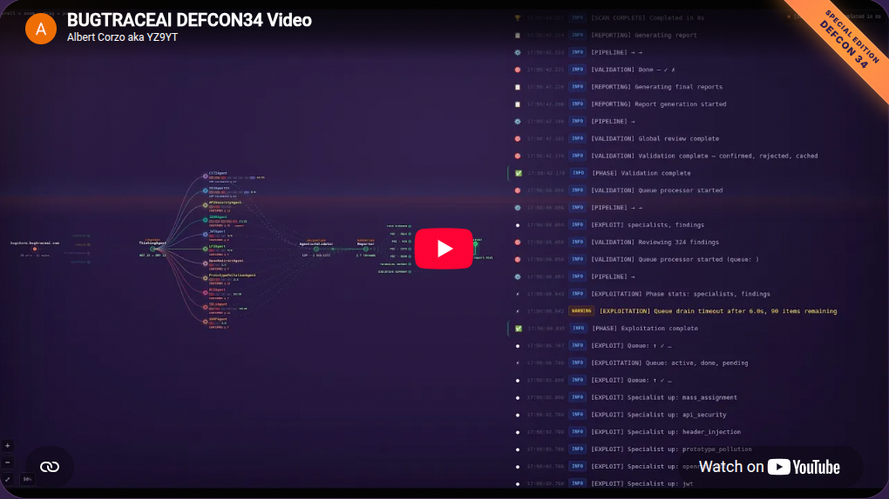
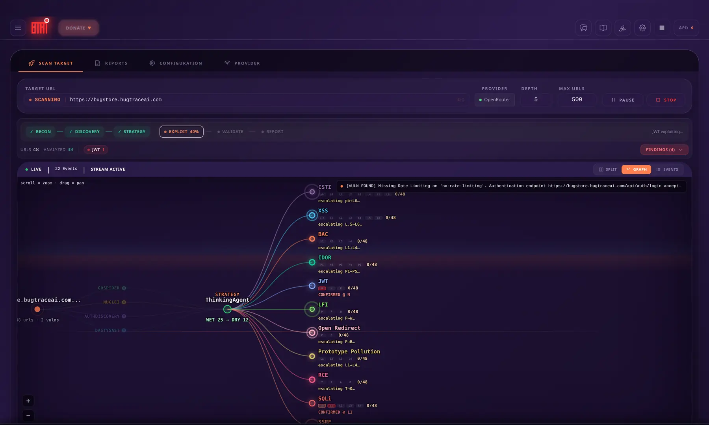
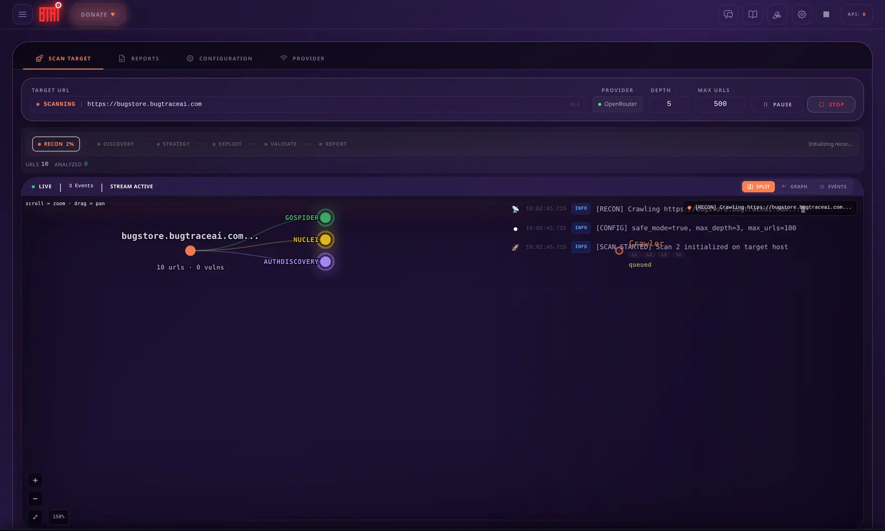
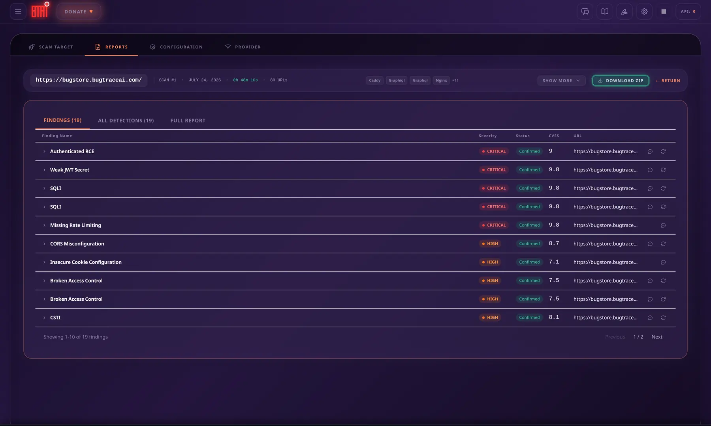
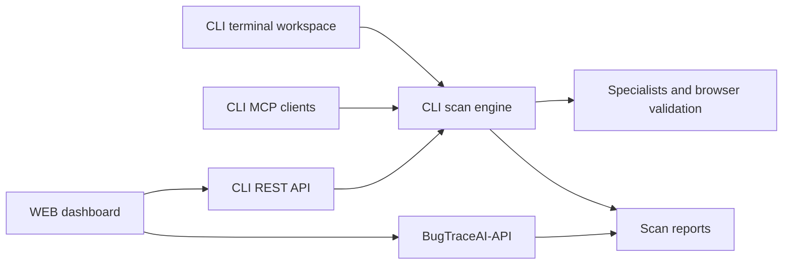
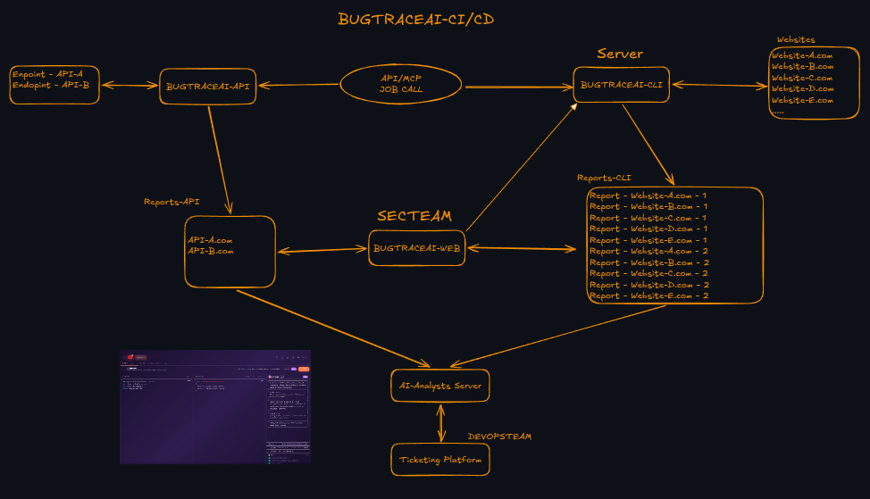

<p align="center">
  
</p>

<h1 align="center">BugTraceAI</h1>

<p align="center">
  Autonomous, self-hosted security testing for authorized bug bounty and pentesting
</p>

<p align="center">
  <a href="https://bugtraceai.com"></a>
  <a href="https://github.com/BugTraceAI/BugTraceAI/wiki"></a>
  <a href="https://deepwiki.com/BugTraceAI/BugTraceAI"></a>
  <a href="https://demo.bugtraceai.com/bugtraceai"></a>
  <a href="https://discord.gg/5HjujkScC"></a>
  <a href="https://github.com/BugTraceAI/BugTraceAI/releases/download/demo-report/BugTraceAI-Demo-Report.zip"></a>
  
  
  
  
  
</p>

<p align="center">
  
  
  
  
  
  
</p>

<p align="center">
  <a href="https://www.youtube.com/watch?v=FCoQNgO8hmM"></a>
  <a href="https://demo.bugtraceai.com/bugtraceai"></a>
  <a href="https://github.com/BugTraceAI/BugStore"></a>
  <a href="https://github.com/BugTraceAI/BugTraceAI/stargazers"></a>
  <a href="https://discord.gg/5HjujkScC"></a>
</p>

<p align="center">
  <a href="https://www.youtube.com/watch?v=FCoQNgO8hmM">
    
  </a>
</p>

## Jump To

- [Proven in the Security Community](#proven-in-the-security-community)
- [What is BugTraceAI?](#what-is-bugtraceai)
- [The Ecosystem](#the-ecosystem)
- [Architecture](#architecture)
- [Scanning Pipeline](#scanning-pipeline)
- [Current Public Releases](#current-public-releases)
- [Demo Report](#demo-report)
- [CI/CD Integration Proposal](#cicd-integration-proposal)
- [Quick Start](#quick-start)
- [Documentation](#documentation)
- [Community & Support](#community--support)

---

## Proven in the Security Community

### CVEs Disclosed

| Product | CVE | CVSS |
| ------- | --- | ---- |
| Wallos | [CVE-2026-27479](https://www.cve.org/CVERecord?id=CVE-2026-27479) | 7.7 High |
| ZoneMinder | [CVE-2026-27470](https://www.cve.org/CVERecord?id=CVE-2026-27470) | 8.8 High |
| Piwigo | [CVE-2026-27834](https://www.cve.org/CVERecord?id=CVE-2026-27834) | 7.2 High |

### Presented On Stage

- [RootedCON 2026](https://reg.rootedcon.com/cfp/speaker/795), Madrid, Spain
- [HKOSCon 2026](https://hkoscon.org/2026/topic/bugtraceai-open-source-agentic-ai-for-autonomous-multi-agent-bug-bounty-pentesting/), Hong Kong
- [DEF CON 34](https://defcon.org/html/defcon-34/dc-34-speakers.html#content_66648), Las Vegas, USA

### See It Working

**CLI 4.0.16-beta · interactive terminal workspace**


The real TUI has five views: **Pipeline, Findings, Agents, Timeline and Logs**.
Configure the target, crawl limits, Provider/F7 and Auth/F8 from the workspace.
The terminal capture uses the built-in offline demo with sample data.
[Open the CLI screenshot gallery and installation guide](https://github.com/BugTraceAI/BugTraceAI-CLI#terminal-workspace).

<table>
  <tr>
    <td width="50%"><strong>WEB · API discovery</strong><br/></td>
    <td width="50%"><strong>WEB · specialist graph</strong><br/></td>
  </tr>
  <tr>
    <td width="50%"><strong>WEB · scan console</strong><br/></td>
    <td width="50%"><strong>WEB · report explorer</strong><br/></td>
  </tr>
</table>

WEB captures show the scan and reporting interfaces using the BugStore practice
target. Report counts in screenshots describe those example sessions.

BugTraceAI combines AI-guided investigation with deterministic security tools. The AI prioritizes and reasons about hypotheses; tools and evidence validate what is real.

## Disclaimer

This platform is provided for **educational and authorized security testing purposes only**.

- Only test applications for which you have **explicit, written authorization**
- AI output may contain inaccuracies, false positives, or false negatives
- It is **not** a substitute for professional security auditing
- The creators assume no liability for misuse or damage

**Always verify findings manually.**

---

## What is BugTraceAI?

**BugTraceAI** is an **opensource, self-hosted framework for bug bounty hunting and penetration testing**. It combines autonomous AI agents with real security tools to discover, analyze, exploit, and validate vulnerabilities independently.

Its agents plan and prioritize checks, route work to specialists and collect evidence through the scanning tools and validation stages.

### Core Principles

| Principle         | Description                                                             |
| ----------------- | ----------------------------------------------------------------------- |
| **Privacy-First** | Self-hosted scanning and report storage; analysis uses your configured LLM provider |
| **Opensource**    | Apache-2.0 licensed public product repositories |
| **Self-Hosted**   | Scan reports and local services stay on your infrastructure                                  |
| **Modular**       | Use components independently or together                                |
| **Deployment**   | Local or Docker CLI profiles; full-platform setup through Launcher                                     |

---

## The Ecosystem

BugTraceAI is composed of **4 independent but interconnected components**, plus a dedicated practice target:

<table>
  <tr>
    <th>Component</th>
    <th>Description</th>
    <th>Tech Stack</th>
    <th>Repository</th>
  </tr>
  <tr>
    <td><strong>BugTraceAI-API</strong></td>
    <td>Standalone evidence-first API security testing service over REST and MCP</td>
    <td>Python + FastAPI + Docker</td>
    <td><a href="https://github.com/BugTraceAI/BugTraceAI-API">BugTraceAI-API</a></td>
  </tr>
  <tr>
    <td><strong>BugTraceAI-CLI</strong></td>
    <td>Autonomous security scanner with a Textual terminal workspace, REST API and MCP. Multi-agent pipeline with specialist tools and browser validation</td>
    <td>Python + Textual + FastAPI + Go + Playwright</td>
    <td><a href="https://github.com/BugTraceAI/BugTraceAI-CLI">BugTraceAI-CLI</a></td>
  </tr>
  <tr>
    <td><strong>BugTraceAI-WEB</strong></td>
    <td>Web dashboard with 20+ AI security tools, real-time scan monitoring, and CLI control center</td>
    <td>React + Express + PostgreSQL</td>
    <td><a href="https://github.com/BugTraceAI/BugTraceAI-WEB">BugTraceAI-WEB</a></td>
  </tr>
  <tr>
    <td><strong>BugTraceAI-Launcher</strong></td>
    <td>Guided deployment with CLI TUI/API profiles, local or Docker runtime, optional global btai, service management and an optional <strong>AI Setup & Repair Assistant</strong></td>
    <td>Bash + Python + Docker Compose</td>
    <td><a href="https://github.com/BugTraceAI/BugTraceAI-Launcher">BugTraceAI-Launcher</a></td>
  </tr>
  <tr>
    <td><strong>MCP Ecosystem</strong></td>
    <td>Extensible agent framework using the Model Context Protocol. Includes integrated Kali Linux and ReconFTW agents</td>
    <td>MCP + Docker + Python</td>
    <td><a href="https://github.com/BugTraceAI/reconftw-mcp">reconftw-mcp</a></td>
  </tr>
  <tr>
    <td><strong>BugStore</strong></td>
    <td>Deliberately vulnerable practice target used in demos and walkthroughs. Full-featured shop riddled with 32 planted OWASP vulnerabilities</td>
    <td>Python + FastAPI + SQLite</td>
    <td><a href="https://github.com/BugTraceAI/BugStore">BugTraceAI/BugStore</a></td>
  </tr>
</table>

Use the CLI TUI locally, its API/MCP for automation, or the Launcher for a full WEB deployment. The WEB connects to the appropriate scanning backend for each engine; API scans use BugTraceAI-API and web scans use the CLI API.

---

## Architecture


```mermaid
flowchart LR
    TUI[CLI terminal workspace] --> Engine[CLI scan engine]
    WEB[WEB dashboard] --> REST[CLI REST API]
    MCP[CLI MCP clients] --> Engine
    REST --> Engine
    WEB --> API[BugTraceAI-API]
    Engine --> Tools[Specialists and browser validation]
    Engine --> Reports[Scan reports]
    API --> Reports
```

The CLI stores scan metadata in SQLite and writes report artifacts to disk.
The WEB uses PostgreSQL for its own chats, settings and analysis. The Launcher
configures service connections and selected ports. Standalone local TUI setup
opens the engine without starting an API server.

See the [component documentation](#documentation) for deployment details.

---

## Scanning Pipeline

The CLI terminal and WEB display the same six scan phases:

| Phase | Purpose |
| --- | --- |
| **Recon** | Crawl the target and discover endpoints |
| **Discovery** | Analyze URLs and collect initial findings |
| **Strategy** | Consolidate findings and route work to specialists |
| **Exploit** | Run specialist checks and collect evidence |
| **Validate** | Verify findings through the validation stage |
| **Report** | Generate structured and human-readable deliverables |

Target authentication supports Bearer tokens and login YAML with optional
TOTP/2FA. In the TUI, configure it through **Auth/F8**, separately from the
LLM provider's API key in **Provider/F7**. See the
[CLI installation guide](https://github.com/BugTraceAI/BugTraceAI-CLI/blob/main/INSTALLATION.md).

## Current Public Releases

| Component | Version | Highlights |
| --- | --- | --- |
| [CLI](https://github.com/BugTraceAI/BugTraceAI-CLI/releases/tag/v4.0.20-beta) | **4.0.20-beta** | Textual TUI, Provider/Auth setup, automatic installer prerequisites, TUI/API profiles, optional global `btai` |
| [Launcher](https://github.com/BugTraceAI/BugTraceAI-Launcher/releases/tag/v3.0.9) | **3.0.9** | Local/Docker CLI setup, saved profiles, global command and deployment management |
| [WEB](https://github.com/BugTraceAI/BugTraceAI-WEB) | **2.0.24-beta** | Scan dashboard, specialist graph, report explorer, AIrepeater and Model Lab |
| [API](https://github.com/BugTraceAI/BugTraceAI-API) | **1.4.4-beta** | Standalone API security testing over REST and MCP |

For installation with your own coding agent, copy the
[CLI installation prompt](https://github.com/BugTraceAI/BugTraceAI-CLI#install-with-your-ai-coding-agent).
It defaults to local TUI with `btai` and can also select API/MCP or Docker.

---

## Demo Report

Want to see what BugTraceAI produces? Try the **live demo** or download a real scan report generated against [BugStore](https://bugstore.bugtraceai.com/) -- our deliberately vulnerable practice app.

<p align="center">
  <a href="https://demo.bugtraceai.com/bugtraceai">
    
  </a>
  &nbsp;
  <a href="https://github.com/BugTraceAI/BugTraceAI/releases/download/demo-report/BugTraceAI-Demo-Report.zip">
    
  </a>
</p>

> **Benchmark note:** This demo report was produced with an earlier scanner build. Results are useful for exploring the workflow, but should not be treated as a current performance claim for the latest CLI release until re-run under a versioned benchmark protocol.

The zip includes the full markdown report, validated findings JSON, specialist agent results with WET/DRY traceability, reconnaissance data, and PoC enrichment output.

---

## CI/CD Integration Proposal

For CI/CD, automation can call the **CLI REST/MCP interfaces** for web scans or **BugTraceAI-API** for API-target testing. Reports and evidence are available for review in the WEB workspace. The diagram below proposes downstream AI review and ticketing integrations; connect them to the selected engine's supported interfaces.

<p align="center">
  
</p>

This keeps external automation, autonomous scanning, evidence-rich reporting, human review, and remediation coordination connected without hard-coding deployment-specific service endpoints.

---

## Quick Start

### Choose your setup

- **Terminal workspace:** Linux/macOS and Python 3.10+ for local installation;
  some specialist tools also use Docker when scanning.
- **API/MCP or full WEB platform:** select the relevant profile and runtime in
  the installer. Docker deployments need Docker Engine, Compose and Git.
- **Real scans:** configure a supported provider's API key. Opening the TUI or
  its offline demo does not require starting a scan.

### One-Command Install

**One-liner** (recommended):

```bash
curl -fsSL https://raw.githubusercontent.com/BugTraceAI/BugTraceAI-Launcher/main/install.sh | bash
```

Or clone and run manually:

```bash
git clone https://github.com/BugTraceAI/BugTraceAI-Launcher.git ~/bugtraceai-launcher
~/bugtraceai-launcher/launcher.sh
```

The wizard selects components, runtime, provider configuration and ports. Standalone CLI setup offers TUI, API + MCP or both, followed by local Python or Docker and optional global `btai`. The optional **AI Setup & Repair Assistant** can install or repair a deployment; see the [Launcher documentation](https://github.com/BugTraceAI/BugTraceAI-Launcher) for its current provider settings.

### Deployment Modes

| Mode               | What You Get             | Use Case                         |
| ------------------ | ------------------------ | -------------------------------- |
| **Full Platform**  | WEB + CLI API + BugTraceAI-API; optional TUI | Complete scanning + dashboard |
| **Standalone CLI** | TUI, API + MCP or both; local/Docker | Terminal scans or automation |
| **Standalone WEB** | WEB dashboard + BugTraceAI-API | API testing and report management |

### Alternative: Individual Components

```bash
# CLI only
git clone https://github.com/BugTraceAI/BugTraceAI-CLI.git
cd BugTraceAI-CLI
./install.sh --interface tui --runtime local --global yes
./bugtraceai-cli
# After opening a new terminal: btai

# WEB only
git clone https://github.com/BugTraceAI/BugTraceAI-WEB.git
cd BugTraceAI-WEB
docker compose up
```

---

## Documentation

Full documentation is available in the **[Project Wiki](https://github.com/BugTraceAI/BugTraceAI/wiki)**:

- [Overview](https://github.com/BugTraceAI/BugTraceAI/wiki/Overview) -- What BugTraceAI is and who it's for
- [Architecture](https://github.com/BugTraceAI/BugTraceAI/wiki/Architecture) -- System design and communication protocols
- [BugTraceAI-CLI](https://github.com/BugTraceAI/BugTraceAI/wiki/BugTraceAI-CLI) -- Autonomous scanner documentation
- [BugTraceAI-WEB](https://github.com/BugTraceAI/BugTraceAI/wiki/BugTraceAI-WEB) -- Web dashboard documentation
- [BugTraceAI-API](https://github.com/BugTraceAI/BugTraceAI-API#readme) -- REST/MCP API-security service, evidence artifacts, and deployment guidance
- [BugTraceAI-API on DeepWiki](https://deepwiki.com/BugTraceAI/BugTraceAI-API) -- AI-powered codebase documentation and architecture exploration
- [BugTraceAI-Launcher](https://github.com/BugTraceAI/BugTraceAI/wiki/BugTraceAI-Launcher) -- Deployment guide
- [CLI API Reference](https://github.com/BugTraceAI/BugTraceAI/wiki/API-Reference) -- CLI REST API and WebSocket endpoints
- [Getting Started](https://github.com/BugTraceAI/BugTraceAI/wiki/Getting-Started) -- Installation and first scan

---

## Community & Support

| Resource | Link                                                             |
| -------- | ---------------------------------------------------------------- |
| Website  | [bugtraceai.com](https://bugtraceai.com)                         |
| Wiki     | [GitHub Wiki](https://github.com/BugTraceAI/BugTraceAI/wiki)     |
| DeepWiki | [AI-powered docs](https://deepwiki.com/BugTraceAI/BugTraceAI)    |
| Issues   | [GitHub Issues](https://github.com/BugTraceAI/BugTraceAI/issues) |
| Discord  | [Join the BugTraceAI community](https://discord.gg/5HjujkScC)    |
| Twitter  | [@yz9yt](https://x.com/yz9yt)                                    |

### Contributing

We welcome contributions: bug reports, feature requests, PRs, documentation improvements, and community tools. Open an issue on the respective repository to get started.

---

## License

**Apache License 2.0** — BugTraceAI-owned material is free to use, modify, and distribute under the terms of the Apache License, Version 2.0.

See LICENSE file in each repository.

---

<p align="center">
  <strong>BugTraceAI</strong> -- Build your own self-hosted pentesting platform.<br/>
  If BugTraceAI helps your authorized security research, consider <a href="https://github.com/BugTraceAI/BugTraceAI/stargazers">giving the project a star</a> or <a href="https://discord.gg/5HjujkScC">joining the community on Discord</a>.<br/>
  <a href="https://github.com/yz9yt">Albert C (@yz9yt)</a>
</p>
